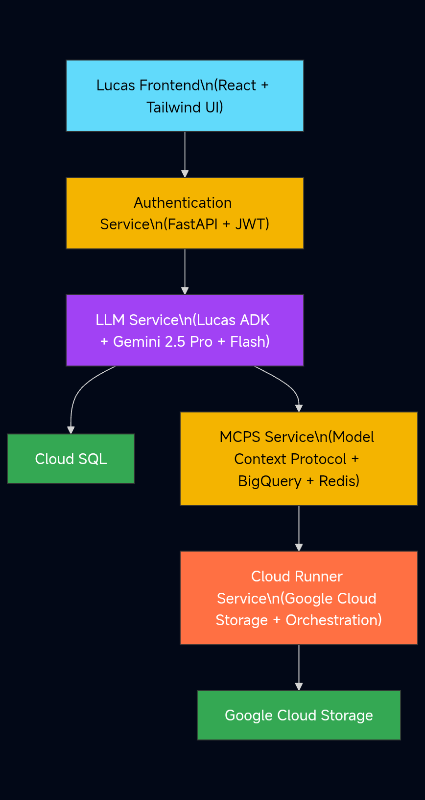
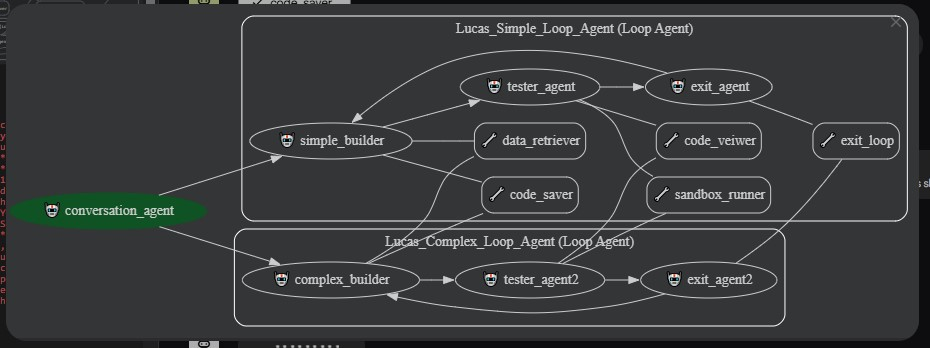

# 🌌 Lucas — Autonomous AI Backtesting & Knowledge System

Lucas is an **autonomous multi-agent system** designed for **automated quantitative trading**, **data analysis**, and **adaptive learning** — built using a **microservices architecture** powered by the **Lucas ADK (Agent Development Kit)**.

This project was developed to help **Retail Traders** have a more solid edge entering into the market, showcasing scalable AI microservices deployed via **Cloud Run**, **FastAPI**, **MCP** and **React**.

---

## 🚀 Overview

Lucas integrates:
- **AI Agents (via the Lucas ADK)** — autonomous agents capable of decision-making, data retrieval, and strategy execution.
- **Microservice-based backend** — modular services for authentication, agents communication, data retrieval, and safe sandbox execution.
- **React frontend** — clean chat-based interface for human–AI collaboration and visual trade insights.
- **Automated Trading Backtester** — simulates, evaluates, and optimizes natural language trading strategies 
- **Cloud-native deployment** — each component containerized with Docker and orchestrated via Google Cloud Run utilizing Cloud run jobs and services.

---

## 🧠 Architecture

  

---

## 🧩 Core Components Folders
- **cloud_runner** - handles the safe executing of scripts in a safe sandbox environment running as a Cloud Run Job, the run job utilizes Google Cloud Storage for the safe uploading and retrieving of files needed.
- **mcps** - The Model Context Protocol Server that handles the data retrieval from the data vendor and the calling of the **cloud_runner** with the intended script to execute. The **mcps** utilizes bigquery and redis to ensure a more smoother performance.
- **llm** - This is the heart of the application where the Agent Development Kit (ADK) is located, the models used here include Gemini 2.5 flash and Gemini 2.5 pro.
- **Auth** - This is the gateway to the app where API calls from the frontend are carefully routed and results returned.
- **lucas-front-main** - As the name implies is the face of the application, providing a User friendly Interface to communicate with the application.

---

## 🧬 Lucas ADK Agent System
The **Lucas ADK (Agent Development Kit)** allows developers to:
- Define and register autonomous agents.
- Create inter-agent communication channels.
- Execute tasks through chain-of-command logic.
- Extend agent abilities with plug-and-play tools (retrievers, webhooks, APIs).
This design is unique because Lucas ADK leverages ADKs Loop Agents to provide a system that let the llms self correct thier mistakes and evaluate generated scripts autonomously.

---

## 🧬 Lucas ADK Agent System Architecture

  

---

## 🧪 Backtester
The Lucas Automated Trading Backtester supports:
-Multiple strategies (momentum, mean reversion, hybrid quant/manual). Highly Flexible
-Real-time performance tracking.
-Visualization via frontend.
-Image uploads.
-Wide Data Range and Multiple Ticker Support

---

## 🧰 Tech Stack
- Frontend: - React, TailwindCSS, Vite
- Backend: - FastAPI, Python
- Database: - PostgreSQL (Cloud SQL), BigQuery, Redis
- Infrastructure: - Docker, Google Cloud Run, MCP
- Agents: - Agent Development Kit, Gemini Models
- Dev Tools: - GitHub Actions, Postman, Lite-xl

---

## 📽️ Demo Video
https://youtu.be/nQmDtZnhoSE?si=bpoS8IBHBif2FI1V

---

## 🌐 Links
- Project Website: - https://lucas-frontend-215805715498.us-central1.run.app
- Author: - Nwabeke Praisejah
- Email: - nwabekepraisejah@gmail.com
